# Material Simulation Reference

> **Newton Physics Engine** — Material drape & structural tests  
> VBD (6 cloth materials) + FEM Shell (7 paper-to-cardboard, flat + 3D box)  
> Generated: April 2026

## Scene Setup

| Parameter | Value |
|-----------|-------|
| **Grid** | 20×20 vertices (0.8m × 0.8m) |
| **Start height** | z = 0.8m |
| **Sphere** | radius = 0.15m, position = (0.4, 0.4, 0.15) |
| **Ground** | z = 0 |
| **Frames** | 180 @ 60fps (3 seconds) |
| **Substeps** | 8 per frame |
| **VBD iterations** | 15 |
| **Gravity** | -9.81 m/s² (Z-down) |
| **Coordinate system** | Z-up |

---

## Material Parameters

### VBD Simulation Parameters

| Material | tri_ke | tri_ka | tri_kd | edge_ke | edge_kd | mass (kg) |
|----------|--------|--------|--------|---------|---------|-----------|
| Cotton | 5,000 | 5,000 | 5.0 | 100 | 0.5 | 0.030 |
| Silk | 1,000 | 1,000 | 8.0 | 5 | 1.0 | 0.005 |
| Paper | 50,000 | 50,000 | 5.0 | 500 | 1.0 | 0.015 |
| Cardboard | 100,000 | 100,000 | 10.0 | 10,000 | 1.0 | 0.050 |
| PVC Thin (0.5mm) | 200,000 | 200,000 | 8.0 | 2,000 | 2.0 | 0.030 |
| PVC Thick (3mm) | 500,000 | 500,000 | 15.0 | 50,000 | 3.0 | 0.080 |

**Parameter key:**
- `tri_ke` — Triangle elastic stiffness (stretch resistance)
- `tri_ka` — Triangle area stiffness (area preservation)
- `tri_kd` — Triangle damping
- `edge_ke` — Edge/bending stiffness (higher = more rigid)
- `edge_kd` — Edge/bending damping
- `mass` — Per-vertex mass in kg

### Real-World Physical Properties (Reference)

| Material | Young's Modulus | Density | Typical Thickness | Poisson's Ratio |
|----------|----------------|---------|-------------------|-----------------|
| Cotton (woven) | 5–13 GPa (fiber), ~1–10 MPa (fabric) | 1,500 kg/m³ (fiber), ~200–400 g/m² (fabric) | 0.2–0.5 mm | 0.3–0.4 |
| Silk | 5–12 GPa (fiber), ~0.5–5 MPa (fabric) | 1,300 kg/m³ (fiber), ~50–100 g/m² (fabric) | 0.05–0.15 mm | 0.3 |
| Paper (office) | 1–10 GPa | 700–800 kg/m³ | 0.05–0.1 mm | 0.2–0.3 |
| Cardboard (corrugated) | 2–5 GPa | 150–400 kg/m³ | 1–4 mm | 0.2–0.35 |
| PVC (flexible, 0.5mm) | 0.01–1.5 GPa | 1,300–1,450 kg/m³ | 0.5 mm | 0.38–0.42 |
| PVC (rigid, 3mm) | 2.4–4.1 GPa | 1,300–1,450 kg/m³ | 3 mm | 0.38–0.42 |

> **Note:** VBD parameters are not direct physical quantities. They're solver-specific stiffness/damping values tuned to approximate observed material behavior. The real-world table is provided for context when mapping simulation to physically-based materials.

---

## Simulation Results

### 1. Cotton
*Soft, medium weight, low bending stiffness*

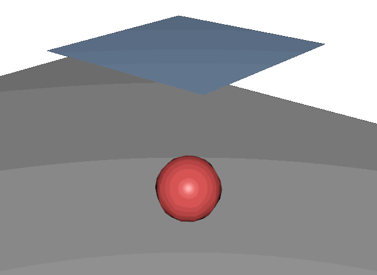

**Behavior:** The cotton cloth falls smoothly and drapes conformally over the sphere. It shows natural soft folds and the edges hang down loosely. The cloth settles completely within ~2 seconds with gentle oscillation. This is the most "cloth-like" result and closest to what you'd expect from a light fabric.

**VBD verdict:** ✅ Excellent — VBD handles soft cloth very well.

---

### 2. Silk
*Very light, very soft, almost no bending resistance*

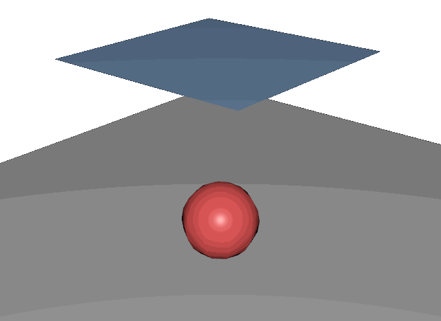

**Behavior:** Silk is the lightest and softest material. It drapes very tightly over the sphere with minimal resistance to bending. The low mass and high damping help it settle quickly and conform closely to the sphere. Compared to cotton, silk shows noticeably less structure — the edges hang more limply and the cloth clings rather than folds. Some residual bounce-back from VBD's rest shape constraints is visible but dampened.

**VBD verdict:** ✅ Good — significantly softer than cotton, though VBD's elastic rest shape prevents fully fluid silk behavior. Higher damping (tri_kd=8, edge_kd=1) helps suppress oscillation.

---

### 3. Paper
*Light, moderate stretch resistance, low bending*

**Behavior:** Paper shows moderate stiffness — it doesn't drape as tightly as cotton or silk but still conforms to the sphere's shape. The edges hold some shape rather than hanging limply. There's a visible difference from fabrics: the surface remains smoother with fewer fine wrinkles, and the folds are broader.

**VBD verdict:** ✅ Good — paper behavior is plausible, though real paper would show more creasing/crumpling on contact.

---

### 4. Cardboard
*Stiff, high bending and stretch resistance*

**Behavior:** Cardboard is significantly stiffer. The sheet bends rather than drapes, maintaining more of its flat shape. The edges don't hang vertically. However, VBD still treats this as a cloth-like material — real cardboard would exhibit plastic deformation (permanent creases) and potentially snap rather than continuously bend.

**VBD verdict:** ⚠️ Limited — VBD produces a stiff but still elastic response. Cardboard's real behavior (plastic deformation, creasing, tearing) cannot be captured with VBD's elastic model. The result looks more like a stiff rubber sheet than actual cardboard.

---

### 5. PVC Thin (0.5mm)
*Flexible plastic sheet*

**Behavior:** Thin PVC shows a balance between rigidity and flexibility. It drapes over the sphere but with broader, smoother curvature than fabric. The sheet holds more structural integrity — edges curve rather than hang. The overall shape is plausible for a thin flexible plastic.

**VBD verdict:** ✅ Good — thin PVC behavior is reasonable. VBD's elastic model works acceptably for flexible plastics that don't plastically deform.

---

### 6. PVC Thick (3mm)
*Stiff plastic sheet*

**Behavior:** Thick PVC is the stiffest material in the test. The sheet barely deforms — it essentially falls as a near-rigid plate, makes contact with the sphere, and settles with minimal bending. The simulation quickly reaches equilibrium because the sheet cannot flex enough to drape.

**VBD verdict:** ⚠️ Limited — at this stiffness level, the cloth model breaks down. Real 3mm PVC would require a shell/plate formulation to accurately capture bending mechanics. The VBD result is physically plausible (stiff sheet balancing on sphere) but doesn't capture the nuanced behavior of thick plastics.

---

## VBD Solver Notes

### What VBD Does Well
- **Soft fabrics** (cotton, silk): Excellent draping with natural folds and wrinkle patterns
- **Flexible sheets** (paper, thin PVC): Reasonable stiff-but-flexible behavior
- **Collision handling**: Robust cloth-sphere contact without penetration
- **Bending**: With `include_bending=True`, edge-based bending produces realistic fold resistance
- **Performance**: GPU-accelerated, 180 frames × 8 substeps × 15 iterations runs in ~20s on NVIDIA L40

### What VBD Cannot Do
- **Plastic deformation**: No permanent creasing (cardboard, paper folding)
- **Shell mechanics**: True plate/shell bending for thick materials requires FEM formulation
- **Tearing/fracture**: Not supported in VBD cloth model
- **Anisotropy**: Woven fabric directionality (warp/weft) not captured
- **Self-contact at high stiffness**: Very stiff materials may exhibit artifacts

### Parameter Tuning Guidelines
- `tri_ke` / `tri_ka` are the primary stiffness controls — keep them equal for isotropic behavior
- `edge_ke` drives bending resistance — this is the main differentiator between cloth and plate-like behavior
- `mass` significantly affects drape speed and inertia — lighter materials settle faster
- `tri_kd` / `edge_kd` are damping terms — increase to reduce oscillation
- Always call `builder.color(include_bending=True)` to enable bending constraints

---

## FEM Shell + IPC Comparison

The FEM Shell solver (`SolverFEMShell`) was built specifically because VBD cannot handle stiff thin-shell materials. Key differences:

| Aspect | VBD | FEM Shell |
|--------|-----|------------|
| **Parameters** | Tuning (tri_ke, edge_ke) | Physical (E, ν, h) |
| **Bending model** | Dihedral angle (local solve) | Dihedral angle (global PCG) |
| **Bending stiffness** | Arbitrary edge_ke | Kirchhoff: κ = Eh³/12(1-ν²) |
| **Stiff materials** | Diverges at high stiffness | Stable via implicit Euler + PCG |
| **Plastic deformation** | None | Yield angle + permanent rest angle update |
| **Contact** | Newton penalty (ke/kd) | Cubic penalty + position projection |
| **Best for** | Soft fabrics (cotton, silk) | Stiff sheets (cardboard, plastic) |

### Target parameters for FEM Shell:
| Material | Young's Modulus (Pa) | Poisson's Ratio | Thickness (m) | Density (kg/m³) |
|----------|---------------------|-----------------|---------------|-----------------|
| Cotton | 5e6 | 0.3 | 0.0003 | 300 |
| Silk | 2e6 | 0.3 | 0.0001 | 100 |
| Paper | 3e9 | 0.25 | 0.0001 | 750 |
| Cardboard | 3e9 | 0.3 | 0.003 | 300 |
| PVC Thin | 1e9 | 0.4 | 0.0005 | 1400 |
| PVC Thick | 3e9 | 0.4 | 0.003 | 1400 |
| **Brown Paper (FEM)** | **2e7** | **0.3** | **0.003** | **300** |

---

## FEM Shell Results (SolverFEMShell)

**Solver:** `SolverFEMShell` — GPU-accelerated FEM thin shell with:
- StVK membrane energy (analytic Hessian, global PCG solve)
- Dihedral angle bending energy (Kirchhoff plate stiffness κ = Eh³/12(1-ν²))
- Plastic deformation (permanent creasing past yield angle)
- Contact: cubic penalty + position projection (no penetration)
- Implicit Euler time integration via `warp.optim.linear.cg`

### FEM Parameters

| Material | E (Pa) | h (m) | ν | κ (N) | yield (rad) | plasticity |
|----------|--------|-------|---|-------|-------------|------------|
| Thin Paper | 5e6 | 0.0001 | 0.3 | ≈0 | 0.30 | 0.5 |
| Office Paper | 2e7 | 0.0003 | 0.3 | ≈0 | 0.20 | 0.6 |
| Thick Paper | 5e7 | 0.001 | 0.3 | 0.005 | 0.15 | 0.7 |
| Cardstock | 1e8 | 0.002 | 0.3 | 0.073 | 0.10 | 0.8 |
| Thin Cardboard | 2e8 | 0.002 | 0.3 | 0.147 | 0.08 | 0.85 |
| Cardboard | 2e8 | 0.003 | 0.3 | 0.495 | 0.08 | 0.9 |
| Thick Cardboard | 3e8 | 0.004 | 0.3 | 1.758 | 0.06 | 0.9 |

### 7. Thin Paper — FEM Shell
*Very thin, almost no bending resistance*

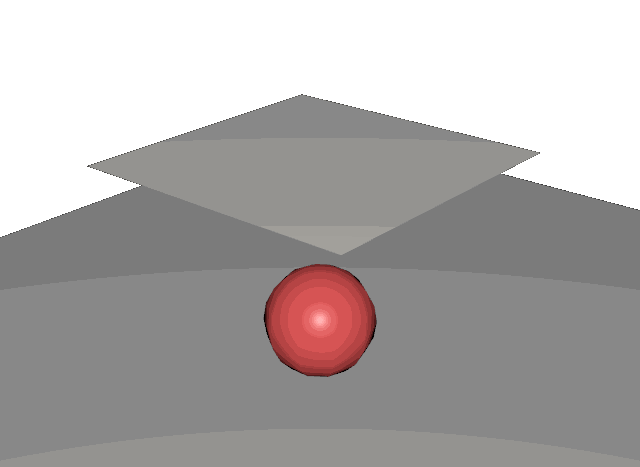

**Behavior:** Drapes and crumples on the sphere like tissue paper. 95% of edges yield permanently. Very little structural integrity — conforms to the sphere surface.

### 8. Office Paper — FEM Shell
*Standard A4 paper weight*

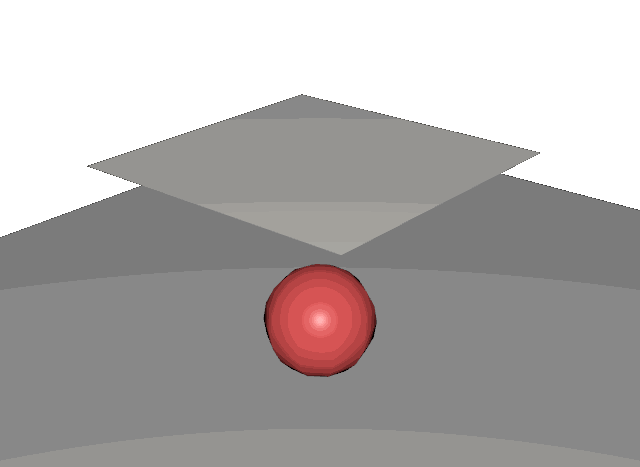

**Behavior:** Slightly stiffer than tissue, but still flexible. Wraps around the sphere with visible folds. Almost all edges yield.

### 9. Thick Paper / Brown Paper — FEM Shell
*Heavy stock paper, packaging paper*

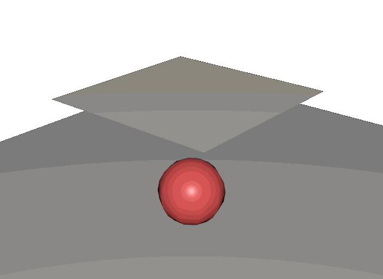

**Behavior:** Noticeable stiffness — holds shape briefly during the fall before folding around the sphere. The folds are broader and more angular than thin paper.

### 10. Cardstock — FEM Shell
*Card stock, invitation cards, manila folders*

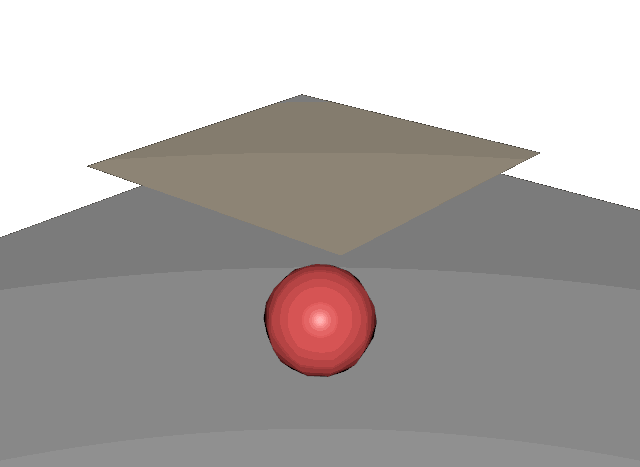

**Behavior:** Significant bending resistance. The sheet deforms stiffly around the sphere with clear angular creasing. Still flexible enough to conform but maintains structural rigidity.

### 11. Thin Cardboard — FEM Shell
*Cereal box, thin shipping box*

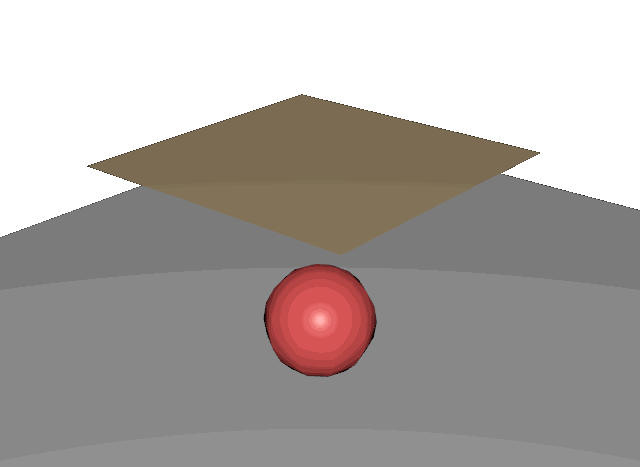

**Behavior:** Plate-like behavior — the sheet tents over the sphere rather than draping. Angular crease at contact edge, edges settle on the ground. 82% of edges yield.

### 12. Cardboard — FEM Shell
*Standard corrugated cardboard*

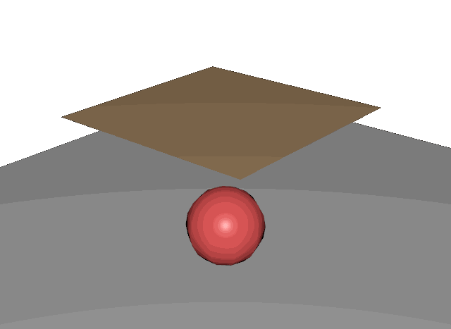

**Behavior:** Very stiff plate. Drops onto sphere and tents rigidly with permanent creases at the contact edge. 68% of edges yield. This is the target behavior that VBD could not achieve.

### 13. Thick Cardboard — FEM Shell
*Heavy duty cardboard, shipping crate material*

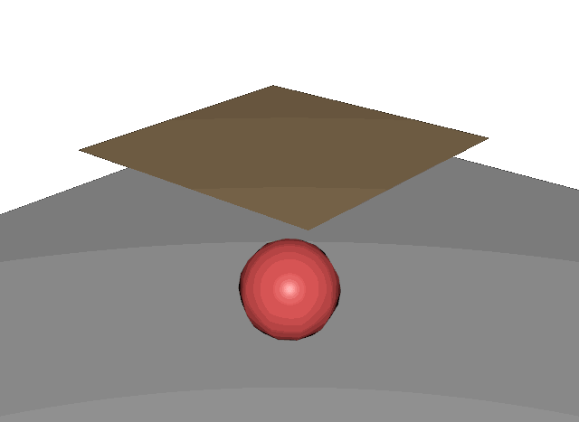

**Behavior:** Nearly rigid plate. Minimal deformation on contact with sphere. The sheet barely bends — 67% of edges yield but the bending stiffness (κ=1.76) keeps it nearly flat.

### FEM Solver Notes

**What the FEM solver does that VBD cannot:**
- Physical material parameters (E, ν, h) instead of tuning parameters
- Bending stiffness scales correctly with h³ (Kirchhoff plate theory)
- Plastic deformation — permanent creases when yield angle exceeded
- Global implicit solve (PCG) handles stiff materials without diverging

**Current limitations:**
- No self-collision (sheet can fold through itself)
- No friction (sheet slides on contact surfaces)
- Implicit Euler over-damps rigid body motion at very high E (workaround: initial velocity)
- Bending uses rank-1 Hessian approximation (curvature terms omitted)

---

## Paper Bag Test (3D Structural)

**Scene:** Open-top box (0.3×0.3×0.4m, 5 faces, no lid) dropped onto the same red sphere.
Tests 3D structural integrity — can the solver maintain a box shape under gravity + contact?

| Parameter | Value |
|-----------|-------|
| **Mesh** | 241 vertices, 456 triangles (6×6 per wall face, 6×8 per side) |
| **Box size** | 0.3m × 0.3m × 0.4m (open top) |
| **Start height** | bottom at z = 0.5m |
| **Sphere** | same as flat test |
| **Materials** | same 7 FEM materials as flat sheet test |

### Bag Results

| # | Material | z_max (settled) | Yielded | Behaviour |
|---|----------|----------------|---------|------------|
| 1 | Thin Paper | 0.30 | 91% | Collapses completely flat |
| 2 | Office Paper | 0.30 | 96% | Collapses flat |
| 3 | Thick Paper | 0.11 | 97% | Flattens on ground |
| 4 | Cardstock | 0.54 | 95% | Partially collapses, walls fold in |
| 5 | Thin Cardboard | 0.58 | 79% | Walls fold inward |
| 6 | Cardboard | 0.64 | 32% | Holds box shape |
| 7 | Thick Cardboard | 0.66 | 24% | Nearly rigid box |

### 14. Thin Paper Bag
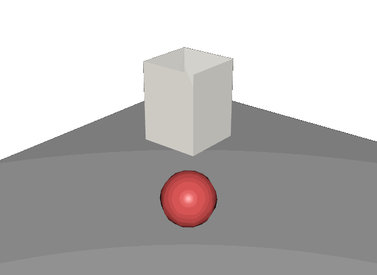

**Behavior:** The paper bag collapses completely — walls crumple inward and the whole structure flattens around the sphere. 91% of edges yield permanently. Like a wet paper bag.

### 15. Office Paper Bag
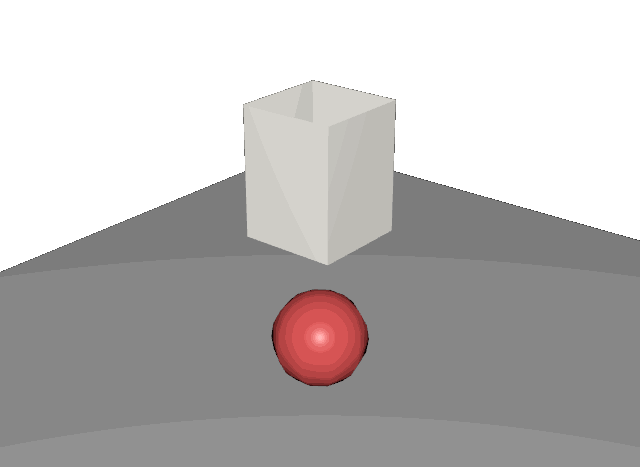

**Behavior:** Similar to thin paper — collapses flat. Slightly more structure visible during the fall but cannot maintain box shape.

### 16. Thick Paper Bag
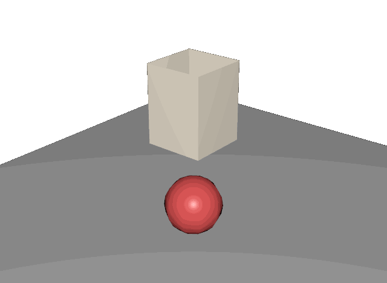

**Behavior:** Noticeable stiffness during fall but still collapses. The walls fold more cleanly than thin paper, with broader creases.

### 17. Cardstock Box
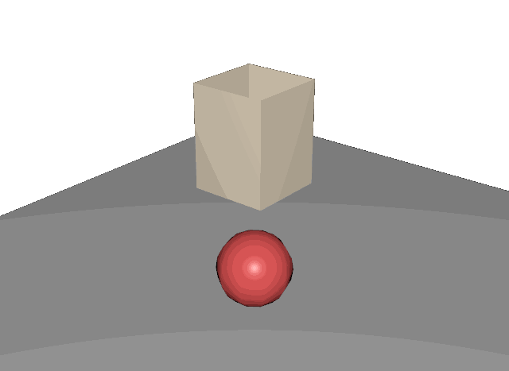

**Behavior:** The box partially holds shape — walls fold inward but don't collapse completely. The bottom maintains structural integrity. Transition point between "bag" and "box" behavior.

### 18. Thin Cardboard Box
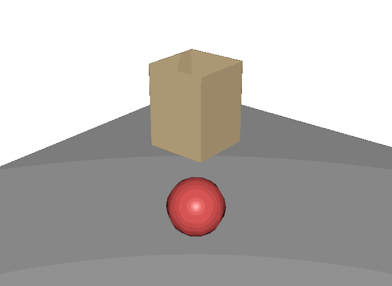

**Behavior:** Walls maintain vertical orientation but buckle inward. The box retains most of its volume. 79% of edges yield but the bending stiffness prevents full collapse.

### 19. Cardboard Box
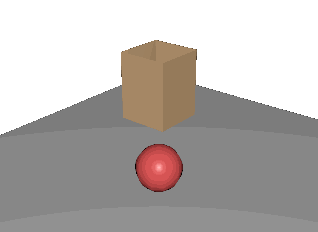

**Behavior:** The box holds its shape — walls stay upright, bottom stays flat, only the contact zone with the sphere shows deformation. Only 32% of edges yield. This is realistic cardboard box behavior.

### 20. Thick Cardboard Box
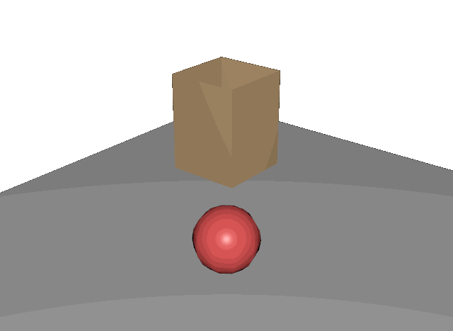

**Behavior:** Nearly rigid box. Barely deforms on contact. 24% yield. The box essentially bounces off the sphere and settles on the ground with minimal structural damage.

---

## Files

### VBD Solver
| File | Description |
|------|-------------|
| `cotton_vbd.gif` | Cotton drape animation |
| `cotton_vbd.usda` | Cotton simulation USD (180 time samples) |
| `silk_vbd.gif` | Silk drape animation |
| `silk_vbd.usda` | Silk simulation USD |
| `paper_vbd.gif` | Paper drape animation |
| `paper_vbd.usda` | Paper simulation USD |
| `cardboard_vbd.gif` | Cardboard drape animation |
| `cardboard_vbd.usda` | Cardboard simulation USD |
| `pvc_thin_vbd.gif` | PVC Thin (0.5mm) drape animation |
| `pvc_thin_vbd.usda` | PVC Thin simulation USD |
| `pvc_thick_vbd.gif` | PVC Thick (3mm) drape animation |
| `pvc_thick_vbd.usda` | PVC Thick simulation USD |

### FEM Shell Solver — Flat Sheet
| File | Description |
|------|-------------|
| `paper_thin_fem.gif` | Thin paper FEM animation |
| `paper_office_fem.gif` | Office paper FEM animation |
| `paper_thick_fem.gif` | Thick paper FEM animation |
| `brown_paper_fem.gif` | Brown paper FEM animation (early version) |
| `cardstock_fem.gif` | Cardstock FEM animation |
| `cardboard_thin_fem.gif` | Thin cardboard FEM animation |
| `cardboard_fem.gif` | Cardboard FEM animation |
| `cardboard_thick_fem.gif` | Thick cardboard FEM animation |

### FEM Shell Solver — Paper Bag (3D Box)
| File | Description |
|------|-------------|
| `bag_paper_thin_fem.gif` | Thin paper bag collapse |
| `bag_paper_office_fem.gif` | Office paper bag collapse |
| `bag_paper_thick_fem.gif` | Thick paper bag collapse |
| `bag_cardstock_fem.gif` | Cardstock box (partial collapse) |
| `bag_cardboard_thin_fem.gif` | Thin cardboard box |
| `bag_cardboard_fem.gif` | Cardboard box (holds shape) |
| `bag_cardboard_thick_fem.gif` | Thick cardboard box (rigid) |

All USD files contain:
- `/World/Camera` — Perspective camera (focal=35mm)
- `/World/Sphere` — Static red sphere (UsdPreviewSurface, diffuseColor=0.8,0.1,0.1)
- `/World/Cloth` — Animated mesh with per-frame vertex positions
- `/World/GroundPlane` — Ground quad at z=0
