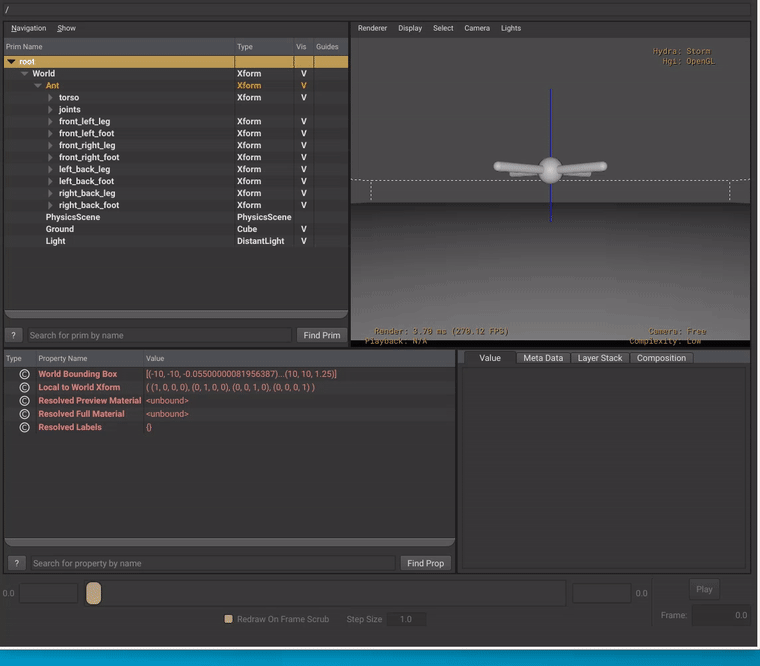

# Newton Physics OpenExec Plugin

An OpenExec plugin that integrates
[Newton](https://github.com/newton-physics/newton) (GPU-accelerated,
Disney/DeepMind/NVIDIA) with OpenUSD for rigid-body simulation driven
by `UsdPhysicsRigidBodyAPI` schemas.



*UsdView + Storm rendering. Newton GPU (XPBD solver, NVIDIA L40)
drives rigid body transforms live through HdExec → Hydra — no baking, no session layer.*

## Architecture

```
USD Stage (single open)
  → Newton GPU: ModelBuilder.add_usd(stage) → Model (GPU)
    → solver.step() → state.body_q (Warp CUDA buffer)
      → body_q.numpy() → Python TransformProvider
        → pxr.HdExec.RegisterTransformProvider
          → HdExecComputedTransformSceneIndex → Hydra Storm
```

### Newton GPU Engine (`python/engine.py`)

`NewtonEngine` wraps Newton's `ModelBuilder` → `Model` → `Solver` → `State`:

1. **`initialize(stage)`** — `ModelBuilder.add_usd(stage)` parses all
   `UsdPhysics` schemas (bodies, shapes, joints, materials)
2. **`step(dt)`** — `model.collide()` + `solver.step()` on GPU
3. **`get_transform(path)`** — reads `body_q` → converts to `GfMatrix4d`

### Solver Backends

8 GPU-accelerated solvers, all with the same `step()` interface:

| Solver | Best for |
|--------|----------|
| `SolverXPBD` | Real-time rigid bodies (default) |
| `SolverMuJoCo` | Robotics, articulations |
| `SolverFeatherstone` | Precise joint dynamics |
| `SolverSemiImplicit` | Fast, simple |
| `SolverVBD` | Deformables |
| `SolverImplicitMPM` | Soft bodies, granular |
| `SolverKamino` | Fluids |
| `SolverStyle3D` | Cloth |

Configure via [Newton USD schemas](https://github.com/newton-physics/newton-usd-schemas):

```usda
def PhysicsScene "PhysicsScene" (
    prepend apiSchemas = ["NewtonSceneAPI", "NewtonXpbdSceneAPI"]
) {
    int newton:timeStepsPerSecond = 1000
    float newton:xpbd:rigidContactRelaxation = 0.8
}
```

### Interactive Picking

Newton GPU includes GPU-accelerated ray casting and spring-damper
force application for interactive body dragging. Exposed via
`engine.begin_pick()` / `update_pick()` / `release_pick()`.

## Usage

### Render with usdrecord

```bash
python newtonRecord.py \
  --camera /World/DemoCamera \
  --frames 0:120 \
  --renderer GL \
  scene.usda output/frame.####.png
```

### Python API

```python
from pxr import HdExec, Sdf, Gf

engine = NewtonEngine(device="cuda:0")
engine.initialize(stage, solver_name="xpbd")

def provider(prim_path, time_seconds):
    engine.advance_to_time(time_seconds)
    return engine.get_transform(prim_path)

HdExec.RegisterTransformProvider("newtonGPU", provider)
```

## Directory Structure

```
newtonPhysics/
├── README.md
├── python/
│   ├── __init__.py              Newton GPU integration package
│   ├── engine.py                NewtonEngine wrapper
│   ├── provider.py              TransformProvider registration
│   └── newtonRecord.py          usdrecord with Newton GPU
└── testenv/
    ├── fallingBox.usda           Single falling box
    ├── demoScene.usda            Camera + scene for rendering
    ├── stackedBoxes.usda         Three stacked boxes
    ├── mixedShapes.usda          Sphere, box, capsule
    ├── kinematicAndDynamic.usda  Kinematic + dynamic interaction
    └── materialFriction.usda     Friction material test
```

## Dependencies

- **[Newton](https://github.com/newton-physics/newton)** — `pip install newton`
- **[NVIDIA Warp](https://github.com/NVIDIA/warp)** — installed with Newton
- **NVIDIA GPU** (Maxwell+) with CUDA 12+ drivers
- **OpenUSD** with OpenExec + HdExec Python bindings

## License

Licensed under the terms set forth in the LICENSE.txt file available at
https://openusd.org/license.
