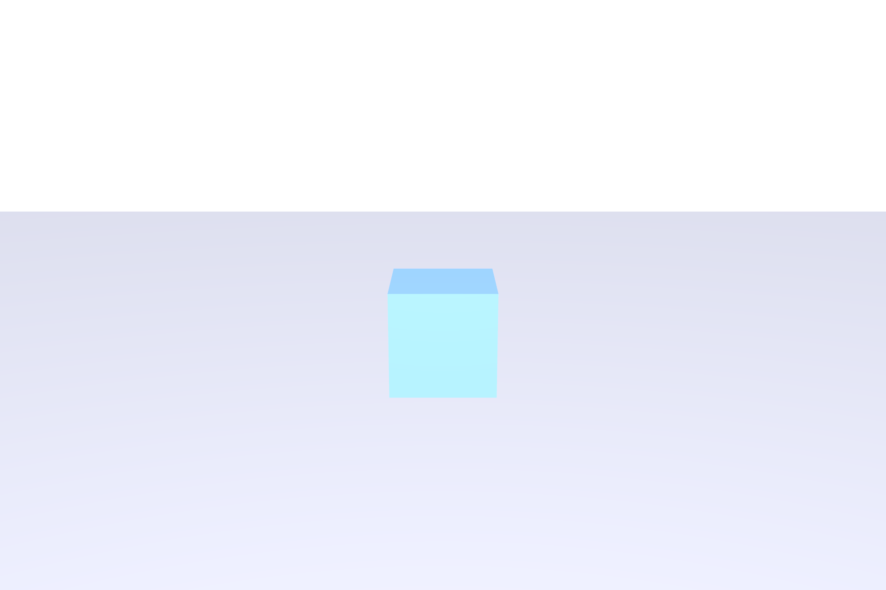
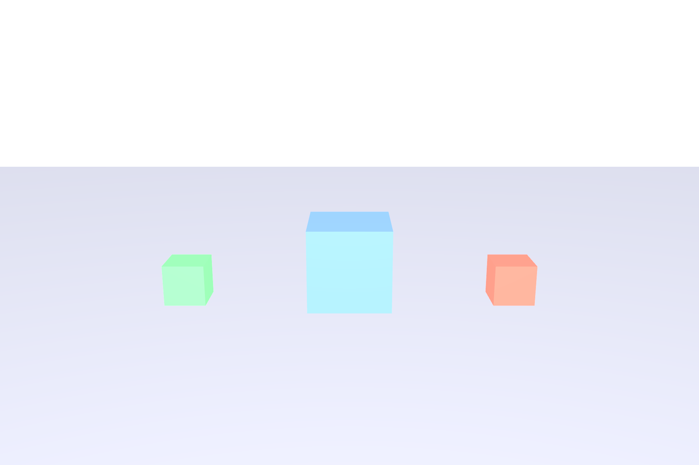

# Units Resolution Demo

End-to-end demonstration of unit-aware value resolution through the Hydra 2 pipeline.

## The Problem

When assets authored in different unit systems (centimeters, millimeters) are referenced into a meter-scale stage, their raw numeric values are interpreted as meters. A 50cm cube becomes 50 **meters**. A bolt at position 10,000mm appears 10 **kilometers** away.

### Before: No units resolution



*Only the blue 1m reference cube is visible. The red cm-scale box is 200m away, the green mm-scale box is 2km away — both invisible at this camera distance.*

### After: With units resolution



*All three cubes are visible: blue (1m, meters), red (50cm → 0.5m, corrected from centimeters), green (500mm → 0.5m, corrected from millimeters). Correct positions, correct sizes.*

## Architecture

```
UsdGeomMetricsAPI (metrics:metersPerUnit on prim)
  → execMetricsUnits (computeUnitAwareLocalToWorldTransform)
    → HdExecComputedTransformSceneIndex (auto-bootstrap)
      → HdFlatteningSceneIndex
        → Storm render delegate
```

## Test Scenes

| File | Description |
|------|-------------|
| `factory_demo_before.usda` | Uncorrected — raw cm/mm values as meters |
| `factory_demo_corrected.usda` | Corrected — transforms scaled by metersPerUnit |
| `factory_demo.usda` | With GeomMetricsAPI — for runtime correction via OpenExec |

## Running in usdview

```bash
cd extras/exec/examples/unitsDemo
usdview factory_demo.usda
```

## Related

- [Units and Scale proposal](https://github.com/jensjebens/OpenUSD-proposals/blob/jjebens/units-and-scale/proposals/units_and_scale/README.md)
- [MetricsAPI core](../../usd/metricsApiCore/README.md)
- [Exec computation](../metricsUnits/)
- [HdExec scene filter](../../../../pxr/imaging/hdExec/README.md)
