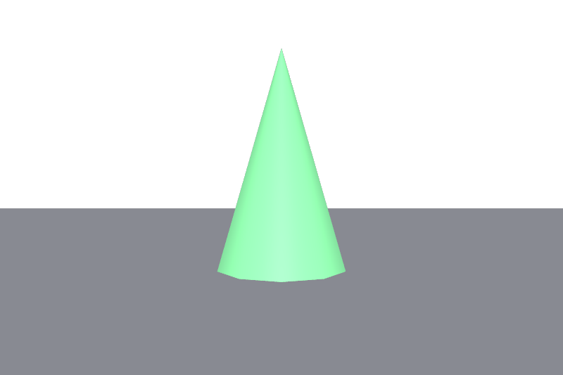
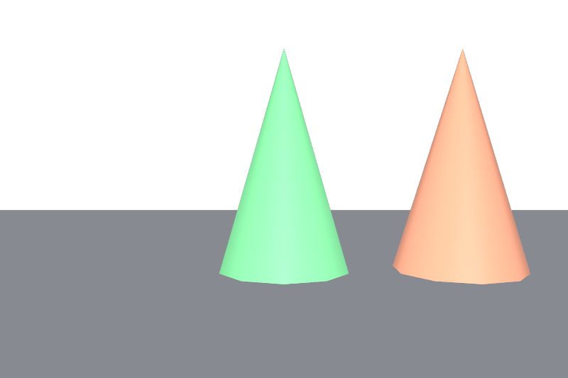

# Units Resolution Demo

End-to-end demonstration of unit-aware value resolution through the Hydra 2 pipeline.

## The Problem

When assets authored in different unit systems are referenced into a stage, their raw numeric values are misinterpreted. A 1-meter cone (height=1) in a centimeter stage appears as 1 **centimeter** tall — invisible next to cm-scale geometry.

### Before: No units resolution



*A cm-scale stage with a green cone (height=100cm) and an orange cone authored in meters (height=1m). Without units resolution, the orange cone is 1cm tall — invisible.*

### After: With units resolution



*With `GeomMetricsAPI` applied, the orange cone's `metersPerUnit=1.0` is detected against the stage's `metersPerUnit=0.01`. The OpenExec computation scales the transform 100×, making both cones the same size.*

## Architecture

```
UsdGeomMetricsAPI (metrics:metersPerUnit on prim)
  → execMetricsUnits (computeUnitAwareLocalToWorldTransform)
    → HdExecComputedTransformSceneIndex (auto-bootstrap)
      → Storm render delegate
```

## Test Scenes

| File | Description |
|------|-------------|
| `cones_before.usda` | Two cones in a cm stage — no MetricsAPI |
| `cones_after.usda` | Same scene with GeomMetricsAPI — runtime correction via OpenExec |

## Rendering

```bash
# Before (no correction)
usdrecord --camera /World/Camera --renderer Storm cones_before.usda cones_before.png

# After (with MetricsAPI correction)
usdrecord --camera /World/Camera --renderer Storm cones_after.usda cones_after.png
```

**Note:** `execMetricsUnits` must be in `LD_LIBRARY_PATH` and its `plugInfo.json` in `PXR_PLUGINPATH_NAME` for the computation to run.

## Known Limitation

The current `execGeom` `computeLocalToWorldTransform` reads only `xformOp:transform` (single matrix op), not composed xformOps like `xformOp:translate` or `xformOp:rotateXYZ`. Scene files must use `xformOp:transform` for the exec pipeline to see the transform.

## Related

- [Units and Scale proposal](https://github.com/jensjebens/OpenUSD-proposals/blob/jjebens/units-and-scale/proposals/units_and_scale/README.md)
- [MetricsAPI core](../../usd/metricsApiCore/README.md)
- [Exec computation](../metricsUnits/)
- [HdExec scene filter](../../../../pxr/imaging/hdExec/README.md)
